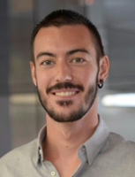

<!---
#Author: Timothée Moulin
#Date : 2019-02-04
#Language: en
-->

# Timothée Moulin

I am a 27 years old **Lead Software Engineer / Technical Manager** now working at [Virtua](https://www.virtua.ch). In my spare time I am involved in the development of [Instant Stock](https://instant-stock.ch/), a web based system helping events and businesses managing their points of sale and giving them a good overview of their current available stock.

---

## Experience

*Dec 2018 - now*

**Technical Manager**, *Virtua (Morges)*

My role as a TM is to manage internal and offshore developers and to give them a technical support when needed. I am also involved in the pre-sale process for projects on various *OpenSource* technologies.

* Human Resource management on a small team
* Technical expertise
* Pre-sale and customer advice

---

*Sep 2016 - Dec 2018*

**Lead Software Engineer**, *Virtua (Morges)*

I have been leading Virtua's Customer Care department for two years. The department was in charge of the maintenance and development of CRM applications and global companies websites.
We were also helping the engineering department in the improvement of the delivery and quality processes.

* Technical lead on various projects (*e-shop*, *CRM*, corporate website) and technologies (*Drupal 7*, *Zend Framework*, *Symfony3*, *Wordpress*)
* Intern and offshore development management
* Customer relationship and project management

---

*Jan 2015 - Sep 2016*

**Software Engineer**, *Virtua (Morges)*

I have been in charge of the maintenance and new features development for websites and CRM applications used by international companies.

* *Zend Framework* development mainly for Calleo CRM projects.
* *Drupal 7* development for multi-domain web platforms with custom publication workflows

---

*Nov 2012 - Dec 2013*

**Software Engineer**, *iomedia communication (Lausanne)*

I mainly worked on the development of newspapers websites including a full subscription system, external news imports, and a Varnish caching system.

* *Symfony2* development for the AllinOne CMS
* *Drupal 7* development for Ringier Romandie newspapers websites.
* *Drupal 7* development for an internal registration portal for Palexpo.

<!--
*2009 - 2010*
-->
<!--
**IT Technician**, VAL-COM Technologie (Sion)
-->
<!--
I finished my first technical school with a 2 years internship in a small IT company where I leaned the basics from web server setup to network security and hardware configuration.
-->

## Education

*2014*

**University English Preparation**, *North Island College (Vancouver Island)*

<!--Being an important part of my job, I decided to go to Canada to improve my English skills.--> I attended college to get the university required level in reading, writing, and speaking.

---

*2011 - 2013*

**PET Degree in Information Technology**, *Centre Professionnel Nord Vaudois (Ste-Croix)*

I specialized myself in software development with a 2 years formation based on the usage of various PHP and JavaScript frameworks, complex database conception, virtualisation. I also learned to work with UI tools and the basics of agile methodology.

---

*2006 - 2010*

**Federal Certificate in Information Technology**, *Ecole des Métiers du Valais (Sion)*

<!--This is where I started my path on the IT road with a polyvalent formation going from mecanic to electronic and IT.-->

## Languages

- *French* : mother tongue
- *English* : fluent

## References

<dl>
  <dt>Michael Erne, Virtua, PM</dt>
  <dd><a href="tel:+41796950825">+41 79 695 08 25</a></dd>
  <dt>Anthony Callegaro, Virtua, CTO</dt>
  <dd><a href="tel:+33695362134">+33 6 95 36 21 34</a></dd>
</dl>

